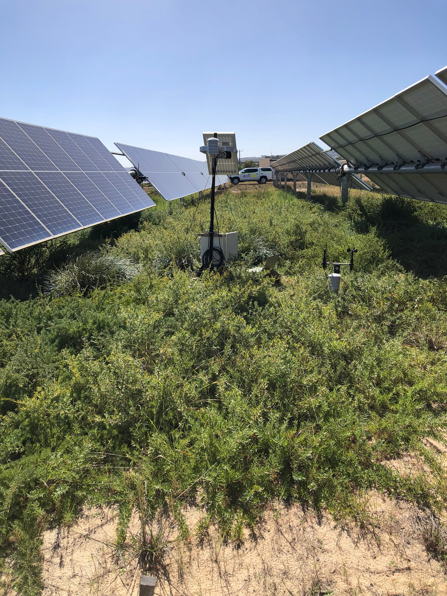
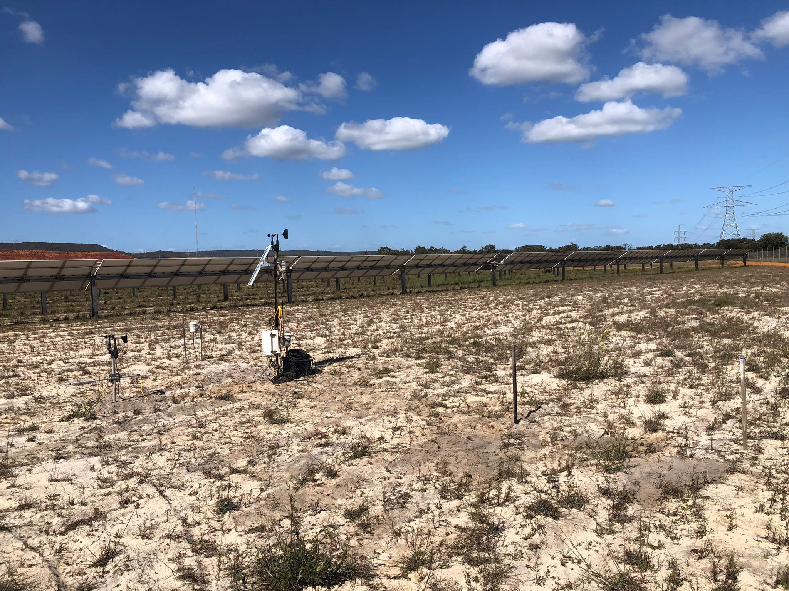
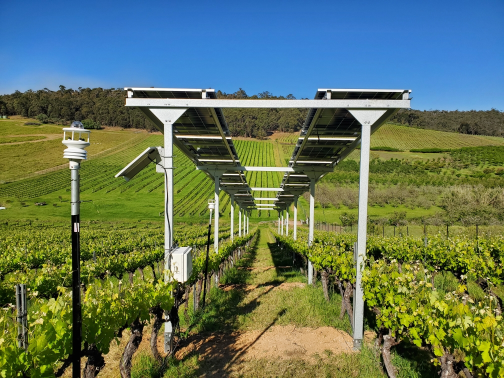
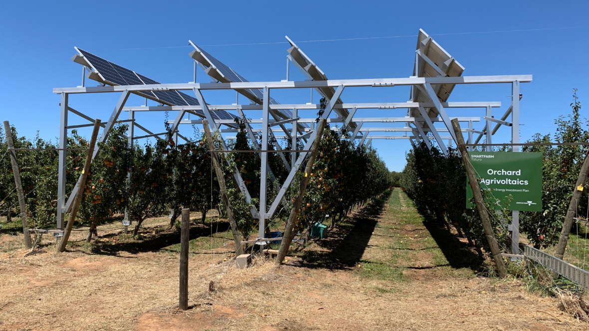
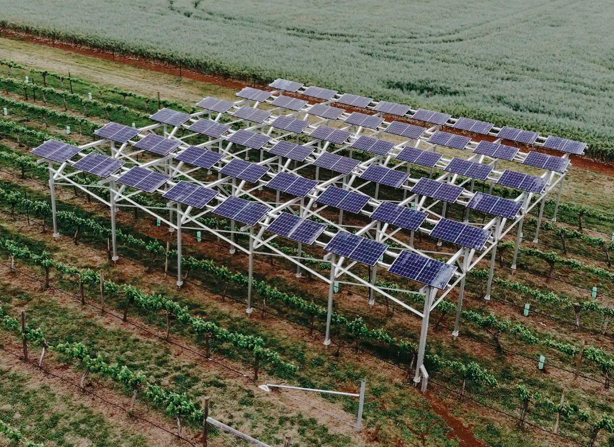

```{r setup, include=FALSE}
knitr::opts_chunk$set(message=FALSE,warning=FALSE, cache=TRUE)
```

I will probably use data from following sites.

# **Boonanarring Solar Farm**

2026 | 10 | 02 Last compiled: `r Sys.Date()`

My favorite site.

{width=25%}

{width=25%}

# **Bickley Vineyard**

2026 | 10 | 02 Last compiled: `r Sys.Date()`

Variables measured: air temperature, humidity, wind, rain gauge, air pressure, soil moisture at 10cm, 20cm and 30cm, solar radiation at 70cm (below canopy) and 195cm (above canopy).

Panels: bifacial panels, facing down side can receive 20% of reflected radiation. 3 rows, total 27 panels. 17 watts.

Issues  identified:

1. Sensors are measuring solar radiation, not net radiation. So I cannot calculate ET in this site, whatever PM equation or residual energy balance approach. Need to remind supervisor if we could install net radiometer in Bickley.

2. There is a slope. The soil moisture sensor at control site is at upper slope and at treatment site is at lower slope. Accuracy of Sws measurement will be affected by this design and slope. If could, we need to relocate control soil moisture sensor, making it perpendicular to the row.

{width=25%}

# **Tatura Smart Farm**

2026 | 10 | 02 Last compiled: `r Sys.Date()`

{width=25%}

A research paper from Tatura Smart Farm experiment: [Long-term effects of agrivoltaics on yield and fruit quality performance of bi-color (blush) pears](https://www.sciencedirect.com/science/article/pii/S0304423826000555)

# **Dookie Campus**

2026 | 10 | 02 Last compiled: `r Sys.Date()`

{width=25%}

A research paper from Dookie Campus: [Synergistic benefits of agrivoltaics for grape production and solar energy efficiency in a Mediterranean vineyard](https://nph.onlinelibrary.wiley.com/doi/full/10.1002/ppp3.70249)


