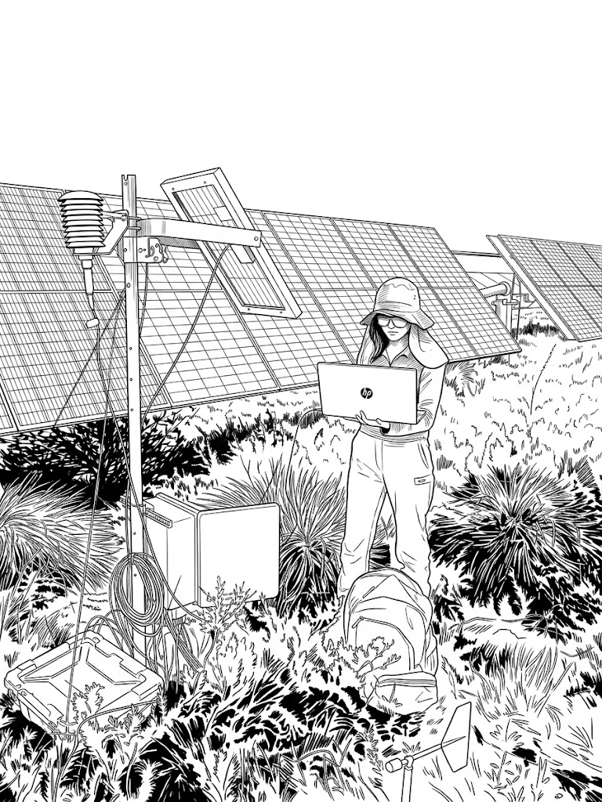

# **Agrivoltaic Learning**

This is a webpage to store my agrivoltaic learning notes. 

I am a dedicated geospatial enthusiast from Hong Kong with a Master of Environmental Science (**Sensing and Spatial Data Science**) at the University of Western Australia, awarded with Distinction. I bring a solid foundation in geospatial modelling and analysis. I'm currently a PhD student at the University of Western Australia.

If I were not doing research, you could find me running along the lake, coding, volunteering or sleeping. 

**My research interests: agrivoltaic, microclimate, ecohydrology, remote sensing**

### [About me: Geospatial and microclimate enthusiast](https://kwanyuchuk.github.io/)

